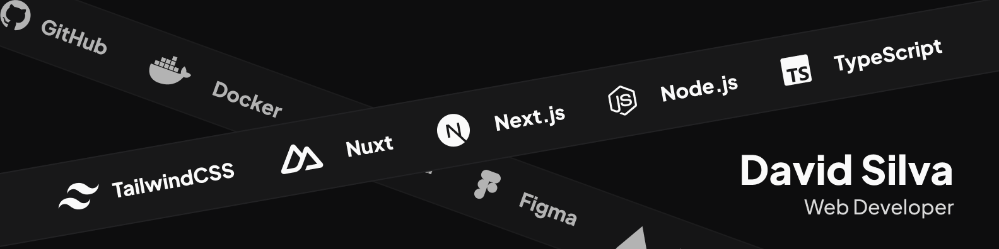

## David da S. Maia, sir! :saluting_face:

Sou David Silva, estudante de Sistemas e Mídias Digitais na Universidade Federal do Ceará (UFC) e desenvolvedor web com foco em full-stack. No front-end, trabalho com frameworks como **Next.js** e **Nuxt**, utilizando **TypeScript** e ferramentas como **Zod**, **react-hook-form** e **TailwindCSS** para criar sistemas robustos, fluidos e escaláveis.

No back-end, estou expandindo minha expertise com **Node.js**, especialmente com o framework **Fastify**, desenvolvendo APIs eficientes e integradas ao front-end. Minha formação multidisciplinar em UI, UX e IHC me ajuda a criar soluções que melhoram a experiência do usuário.

<h6>:dizzy: Vamos nos conectar:</h6>

